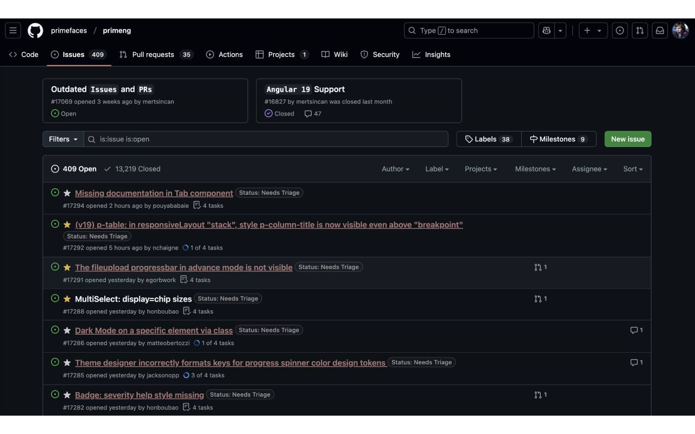
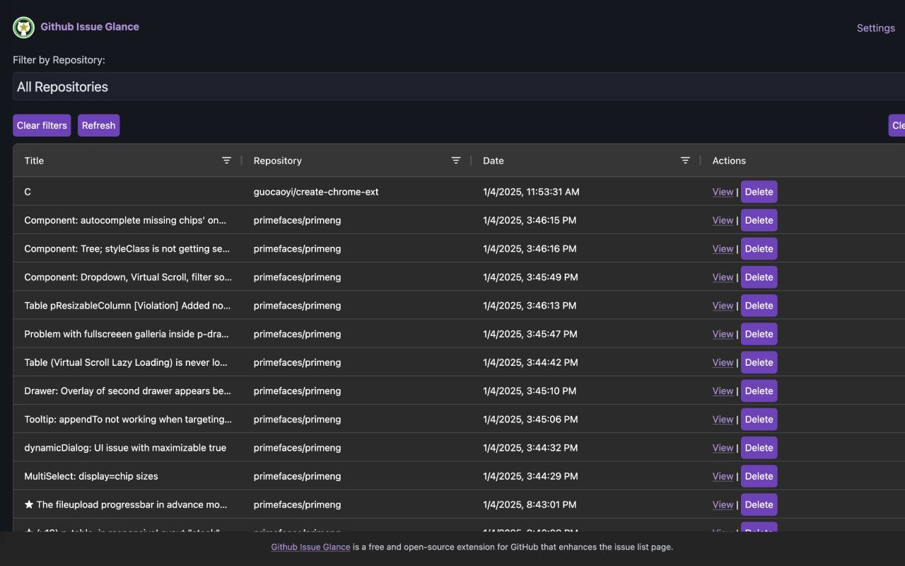

# Github Issue Glance

GitHub Issue Glance helps you bookmark and manage GitHub issues effortlessly. With this Chrome extension, you can star (bookmark) issues directly from the issue page. Built with Vite + Vanilla, and Manifest v3



Access your starred issues on a dedicated options page, where you can view them in a clean, searchable table. Organize and manage your GitHub issues more effectively, saving time and staying focused on what matters most.



## Installing

https://chromewebstore.google.com/detail/github-issue-glance/kallgfejdofmpelngmpklcddomojplod

## Developing

run the command

```shell
$ cd github-issue-glance
$ pnpm install
$ pnpm run dev
```

### Chrome Extension Developer Mode

1. set your Chrome browser 'Developer mode' up
2. click 'Load unpacked', and select `github-issue-glance/build` folder

### Nomal FrontEnd Developer Mode

1. access `http://0.0.0.0:3000/`
2. when debugging popup page, open `http://0.0.0.0:3000//popup.html`
3. when debugging options page, open `http://0.0.0.0:3000//options.html`

Template generated by [create-chrome-ext](https://github.com/guocaoyi/create-chrome-ext)
